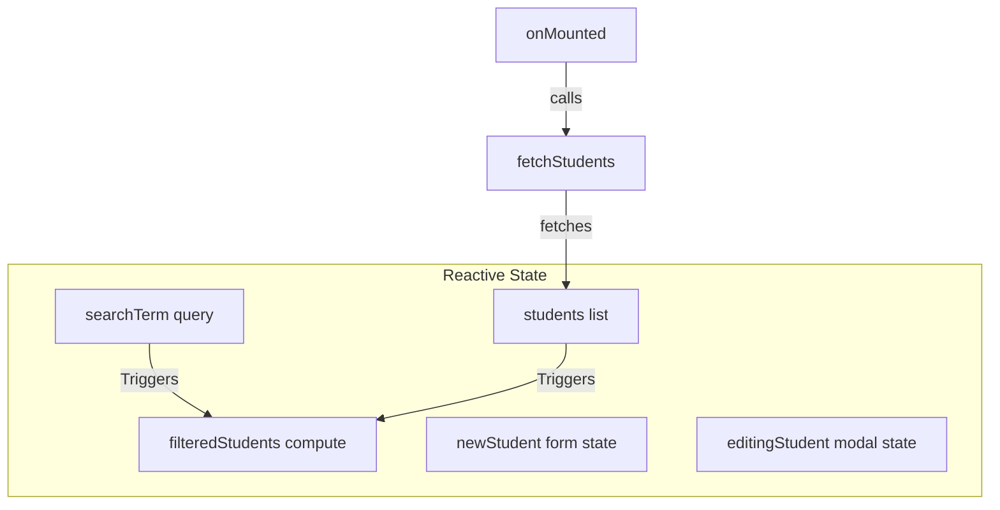

# Student Management System — Technical Architecture & Code Explanation

This document provides a comprehensive technical overview and deep-dive explanation of your Nuxt-based **Student Management System** codebase. 

---

## 🚀 1. Technology Stack Overview

Your application is designed as a modern full-stack web application built on top of the **Nuxt** framework, leveraging both client-side Vue rendering and server-side Nitro API engines.

*   **Frontend**: [Vue 3](https://vuejs.org/) (Composition API, `<script setup>`) running inside [Nuxt 4](https://nuxt.com/) (`^4.4.6`). Styling is managed via vanilla CSS defined within Vue's scoped blocks to guarantee styling encapsulation.
*   **Backend API**: [Nuxt Nitro Engine](https://nitro.unjs.io/) server-side event handlers (`defineEventHandler`).
*   **Database**: [MySQL](https://www.mysql.com/) database server accessed asynchronously using the non-blocking [`mysql2/promise`](https://github.com/sidorares/node-mysql2) driver.

---

## 📂 2. Project Directory Structure

Here is a structural map of your codebase, illustrating where responsibilities are separated:

```
student_Management_System/
├── nuxt.config.js             # Global framework & runtime environment configuration
├── package.json               # Package dependencies and npm run-scripts
├── pages/                     # Vue files representing routes (auto-routing by Nuxt)
│   ├── index.vue              # Admin Login View (root route `/`)
│   └── dashboard.vue          # Core Student Management Dashboard (`/dashboard`)
└── server/                    # Server-side backend code
    ├── utils/
    │   └── db.js              # MySQL connection pool builder and helper
    └── api/
        └── students/          # Server API Endpoints
            ├── index.get.js   # Fetch all student records
            ├── index.post.js  # Add a new student record
            ├── [id].put.js    # Update student details by ID (Route Parameter)
            ├── [id].delete.js # Delete a student record by ID (Route Parameter)
            ├── put.js         # Deprecated update handler
            └── delete.js      # Deprecated delete handler
```

---

## 🔌 3. Database Layer (`server/utils/db.js`)

Your database logic is encapsulated inside [db.js](file:///p:/internship/Day1/student_Managment_System/server/utils/db.js). It provides a structured, high-performance way to talk to your MySQL database.

```javascript
import mysql from 'mysql2/promise';

let pool = null;

export function getPool() {
  if (!pool) {
    pool = mysql.createPool({
      host: 'localhost',
      port: 3306,
      user: 'root',
      password: '',
      database: 'student_db',
      waitForConnections: true,
      connectionLimit: 10,
      queueLimit: 0,
      enableKeepAlive: true,
      keepAliveInitialDelayMs: 0
    });
  }
  return pool;
}
```

### Key Highlights:
1.  **Connection Pooling**: Rather than opening and closing a new connection for every single HTTP request (which is incredibly slow and CPU-heavy), it instantiates a single static pool of up to **10 connections**. Connections are recycled and kept alive (`enableKeepAlive`).
2.  **Safety & Context Release**: The `query(sql, params)` wrapper executes parameterized SQL queries and safely releases connections back to the pool in a `finally` block, preventing connection leaks.
3.  **SQL Injection Prevention**: Parameterized queries (`connection.execute(sql, params)`) ensure values are escaped by MySQL, preventing dangerous SQL Injection attacks.

---

## 🛠️ 4. Server-Side HTTP Endpoints (`server/api/students/`)

Your backend implements RESTful API principles in a modular routing structure.

```mermaid
graph TD
    Client[Vue Frontend Client] -->|GET /api/students| GetStudents[index.get.js]
    Client -->|POST /api/students| AddStudent[index.post.js]
    Client -->|PUT /api/students/:id| UpdateStudent[[id].put.js]
    Client -->|DELETE /api/students/:id| DeleteStudent[[id].delete.js]

    GetStudents -->|SQL SELECT| MySQL[(MySQL Database)]
    AddStudent -->|SQL INSERT| MySQL
    UpdateStudent -->|SQL UPDATE| MySQL
    DeleteStudent -->|SQL DELETE| MySQL
```

### 1. `GET` `index.get.js` ([index.get.js](file:///p:/internship/Day1/student_Managment_System/server/api/students/index.get.js))
*   **Purpose**: Retrieves all students.
*   **SQL Executed**: `SELECT * FROM student ORDER BY id DESC`
*   **Behavior**: Returns an array of student records ordered starting with the most recently added. If an exception occurs, it throws a standard HTTP 500 error.

### 2. `POST` `index.post.js` ([index.post.js](file:///p:/internship/Day1/student_Managment_System/server/api/students/index.post.js))
*   **Purpose**: Creates a new student record.
*   **Payload Validation**: Ensures `name`, `email`, and `admission_date` are present; otherwise returns a `400 Bad Request`.
*   **SQL Executed**:
    ```sql
    INSERT INTO student (name, email, phone, course, admission_date) 
    VALUES (?, ?, ?, ?, ?)
    ```
*   **Response**: Returns the newly created student record including the auto-incremented database `insertId`.

### 3. `PUT` `[id].put.js` ([[id].put.js](file:///p:/internship/Day1/student_Managment_System/server/api/students/[id].put.js))
*   **Purpose**: Updates a student details record using a dynamic route parameter (`/api/students/:id`).
*   **Route Extraction**: Captures the student's primary key from the URL using `event.context.params.id`.
*   **SQL Executed**:
    ```sql
    UPDATE student 
    SET name = ?, email = ?, phone = ?, course = ?, admission_date = ?
    WHERE id = ?
    ```

### 4. `DELETE` `[id].delete.js` ([[id].delete.js](file:///p:/internship/Day1/student_Managment_System/server/api/students/[id].delete.js))
*   **Purpose**: Removes a student record by their primary key.
*   **SQL Executed**: `DELETE FROM student WHERE id = ?`

---

## 🖥️ 5. Frontend Pages (`pages/`)

### 1. Root / Login Page (`pages/index.vue`)
*   **Role**: Serves as a basic administrative login screen.
*   **Authentication Check**:
    ```javascript
    if (email.value === 'admin@student.com' && password.value === 'admin123') {
      navigateTo('/dashboard');
    }
    ```
    *This is a client-side routing check (not session-backed).*
*   **Dead Code Warning**: Contains a call at the bottom: `const { data: users } = await useFetch('/api/users');` designed to fetch users for a debug panel, but no `/api/users` server-side route is implemented.

### 2. Main Dashboard Page (`pages/dashboard.vue`)
This is the workhorse of your system. It displays stats, contains the registration form, search interface, student grid table, and a modal edit dialog.



#### Core UX Features in the Dashboard:
*   **Stats Card**: Computes and dynamically renders `students.length` (Total Students) automatically as records are loaded, updated, or removed.
*   **Live Client-Side Search**: A computed property (`filteredStudents`) dynamically filters the list based on the search query. It performs a case-insensitive check across **all** major columns: `id`, `name`, `email`, `phone`, `course`, and `admission_date`.
*   **Add Form**: Submits new records using `fetch('/api/students', { method: 'POST' })` and clears the form, leaving the date field defaulted to today's date.
*   **Edit Modal Overlay**: Uses a full modal overlay to modify student details. Activating edit binds the selected student object to a reactive template using standard deep cloning (`{ ...student }`), ensuring edits are only saved to the UI after a successful API response.
*   **Smooth UX Feedbacks**: Automatically fades success/error notices after 3 seconds (`setTimeout`) to maintain a clean workspace interface.

---

## 🔍 6. Architectural Discrepancies & Recommendations

While review of your codebase shows a solid foundation, there are several key points of discrepancy, outdated practices, or potential bugs that you can address to make the system robust and professional:

### ⚠️ Discrepancy 1: Environment Variables Mismatch
*   **The Issue**: In your [nuxt.config.js](file:///p:/internship/Day1/student_Managment_System/nuxt.config.js#L5-L12), you have defined a runtime configuration setting up database variables (host, port, credentials, and `dbName: 'student_managment'`). However, in your database helper [db.js](file:///p:/internship/Day1/student_Managment_System/server/utils/db.js#L7-L18), you have completely **hardcoded** the credentials and specified the database name as `student_db`.
*   **Why it matters**: Your server config parameters are completely ignored, and if you deploy this to a production cloud server where the DB is not local or requires a password, the application will immediately crash.
*   **Correction Recommendation**: Use Nuxt's `useRuntimeConfig()` helper in `db.js` to dynamically fetch credentials from `nuxt.config.js`.

### 🧹 Discrepancy 2: Deprecated Files Left in Repo
*   **The Issue**: Both `server/api/students/put.js` and `server/api/students/delete.js` are still present in your directory structure. 
*   **Why it matters**: In Nuxt server routes, to capture parameters from URL endpoints, standard practices favor dynamic parameters. Your dynamic files `[id].put.js` and `[id].delete.js` are correct and active, rendering `put.js` and `delete.js` redundant dead-weight files. 
*   **Correction Recommendation**: Safely delete `server/api/students/put.js` and `server/api/students/delete.js`.

### 🛡️ Discrepancy 3: Lack of Dashboard Route Security
*   **The Issue**: Although you have a login form on the home page (`pages/index.vue`), there is no route middleware, token, or session checking on the `/dashboard` route.
*   **Why it matters**: Anyone who simply enters `http://localhost:3000/dashboard` in their browser address bar will bypass the login screen entirely and gain full access to view, edit, and delete student data.
*   **Correction Recommendation**: Implement a simple Nuxt server-side session check, or standard Nuxt frontend router middleware to protect the `/dashboard` page.

### 🔌 Discrepancy 4: Unusable API Call in Login Page
*   **The Issue**: The [index.vue](file:///p:/internship/Day1/student_Managment_System/pages/index.vue#L68) page contains: `const { data: users, error: fetchError } = await useFetch('/api/users');`
*   **Why it matters**: Since there is no `server/api/users.js` file or handler, this fetch request will always result in a client-side/server-side `404 Not Found` network error.
*   **Correction Recommendation**: Clean up or remove the unused debug users block in `pages/index.vue`.

---

## 🎯 Summary of Database Tables Needed
To ensure this application functions correctly, your MySQL database named `student_db` must contain a table with the following schema:

```sql
CREATE DATABASE IF NOT EXISTS student_db;
USE student_db;

CREATE TABLE IF NOT EXISTS student (
  id INT AUTO_INCREMENT PRIMARY KEY,
  name VARCHAR(255) NOT NULL,
  email VARCHAR(255) NOT NULL,
  phone VARCHAR(50) DEFAULT '',
  course VARCHAR(255) DEFAULT '',
  admission_date DATE NOT NULL
);
```
